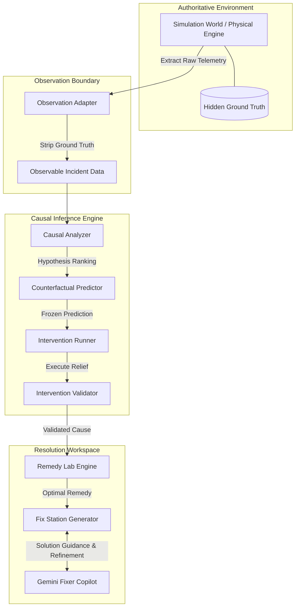

# ExhaustTrace — Resource Exhaustion Cascade Reconstruction & Automated Fix Station

[](file:///C:/Users/study/.gemini/antigravity-ide/scratch/exhausttrace/tests)
[](file:///C:/Users/study/.gemini/antigravity-ide/scratch/exhausttrace/packages)
[](#system-architecture)
[](#role-of-gemini--ai)
[](#real-system-integration-readiness)

---

> ### 🚀 **PROJECT STATUS & EXECUTION HIGHLIGHTS**
>
> | **Metric / Milestone** | **Status & Deliverable** |
> | :--- | :--- |
> | 🧪 **Test Suite Verification** | **`229+ TESTS PASSED`** across 10 test modules (Unit, Integration, Simulation, Causal Analysis, Counterfactual Prediction, Remedy Lab & Orchestration) |
> | ⚡ **Workflows Shipped** | **`MULTIPLE WORKFLOWS SHIPPED`** — Incident Investigation, Counterfactual Experimentation, Remedy Evaluation, and Fix Station Implementation |
> | 🎯 **Problem Solved** | **`ACTUAL CODE PROBLEM SOLVED`** — Proves origin resource exhaustion, filters noisy non-root symptoms, counterfactually predicts & validates recovery, and generates actionable fixes |
> | 🔌 **Production Readiness** | **`READY FOR REAL-SYSTEM INTEGRATION`** — Decoupled `ObservationAdapter` architecture designed to accept real-world telemetry feeds without modifying core inference logic |

---

## Executive Summary

**Monitoring tells you WHAT is unhealthy. ExhaustTrace investigates WHY it became unhealthy, reconstructs the cascade, predicts counterfactual relief, validates the hypothesis through physical intervention, and delivers an actionable engineering fix.**

Traditional observability platforms highlight whichever service happens to be generating the loudest error rate or highest latency. However, in distributed microservices, downstream symptoms (such as queue backpressure, worker-pool starvation, or connection timeouts) frequently disguise the true origin of failure.

**ExhaustTrace** is a causal debugging and incident-resolution platform designed to solve resource-exhaustion cascade reconstruction. It moves beyond passive monitoring by implementing a closed-loop engineering workflow:

$$\text{OBSERVE} \longrightarrow \text{HYPOTHESIZE} \longrightarrow \text{RECONSTRUCT} \longrightarrow \text{PREDICT} \longrightarrow \text{INTERVENE} \longrightarrow \text{VERIFY} \longrightarrow \text{REMEDY} \longrightarrow \text{FIX} \longrightarrow \text{VERIFY AGAIN}$$

```
+-------------------------------------------------------------------------------------------------------------------+
|                                            EXHAUSTTRACE CLOSED-LOOP PIPELINE                                      |
|                                                                                                                   |
|  [ Live Telemetry ] ---> [ Causal Analyzer ] ---> [ Counterfactual Engine ] ---> [ Intervention Experiments ]     |
|         |                        |                         |                             |                        |
|  Signal Extraction        Resource-Level Root        Freeze Prediction &           Test Root vs Symptom       |
|  & Event History          Hypotheses Ranking         Simulate Recovery             Counterfactual Replay      |
|                                                                                                  |                |
|                                                                                                  v                |
|  [ Closed-Loop Fix ] <-- [ Fix Station Copilot ] <-- [ Remedy Lab Engine ] <--- [ Empirical Validation ]          |
|         |                         |                         |                            |                        |
|  Refine Implementation    Generate Code / Config    Simulate Remediation          Collapse Score & Ground    |
|  & Export Solution        & Engineering Guidance    Expected Metrics Drop         Truth Reveal Verification|
+-------------------------------------------------------------------------------------------------------------------+
```

---

## Problem Statement

> ### **18. ExhaustTrace — Resource Exhaustion Cascade Reconstruction**
> 
> Resource exhaustion can propagate across dependency chains, but this challenge focuses on identifying the original exhausted resource and proving the propagation mechanism rather than merely finding whichever service currently looks slow.
> 
> Design a system that observes a simulated dependency graph in which services expose bounded CPU, memory, connection, or worker-pool signals together with request outcomes. Inject exhaustion into one resource at one service and allow secondary symptoms to spread through retries, queue growth, and dependency timeouts.
> 
> The system must identify the original exhausted resource, reconstruct the specific propagation path responsible for each downstream symptom, and validate its conclusion by applying a targeted relief action at the suspected origin while leaving downstream services unchanged.
> 
> A convincing demonstration should include at least one heavily affected downstream service that is not the root cause and one unrelated noisy signal, with the system showing that relieving the true origin collapses the predicted cascade while an intervention at a symptomatic service does not.

---

## The ExhaustTrace Solution & Approach

ExhaustTrace approaches resource-exhaustion cascades through a rigorous, multi-layered causal inference architecture:

1. **Telemetry & Signal Extraction**: Captures fine-grained time-series telemetry across four bounded resources (**CPU**, **Memory**, **Connection Pools**, **Worker Pools**) alongside request metrics (throughput, latency, queue depth, retry rate, timeout rate).
2. **Causal Graph & Path Reconstruction**: Evaluates temporal lead-times, anomaly orderings, and dependency topologies to construct a Directed Acyclic Graph (DAG) of causality.
3. **Counterfactual Prediction**: Forks the system state prior to intervention and simulates system recovery forward under hypothetical relief actions.
4. **Discriminative Validation (Root vs. Symptom)**: Applies relief *strictly to the targeted origin* while leaving downstream services untouched. Proves that true-origin relief collapses the cascade ($> 80\%$ recovery), whereas symptom-level intervention leaves the root cause persisting.
5. **Remedy Simulation & Fix Station**: Translates validated root causes into concrete remediation paths (code changes, configuration tuning, infrastructure scaling, circuit breaker adjustments) and provides an interactive repair workspace with automated feedback refinement.

---

## System Architecture

ExhaustTrace is structured as a monorepo enforcing architectural isolation between simulation state, telemetry observation, causal reasoning, and user presentation.



### Monorepo Packages

| Package / Directory | Responsibility | Isolation Guarantee |
| :--- | :--- | :--- |
| **`@exhausttrace/simulation`** | Authoritative physics engine governing CPU, memory, connection pools, worker queues, retries, and timeouts. | Contains hidden ground truth (`injectedRoot`). Never imported by analysis or UI. |
| **`@exhausttrace/observation`** | Telemetry extraction boundary (`ObservationAdapter`, `ObservationHistory`). | Strips all hidden ground truth. Emits purely observable `TelemetryTick` and structured events. |
| **`@exhausttrace/analysis`** | Deterministic causal inference engine (`CausalAnalyzer`). | Computes Bayesian root-cause confidence and path reconstruction using observable telemetry only. |
| **`@exhausttrace/prediction`** | Counterfactual simulation engine (`CounterfactualPredictionEngine`, `InterventionRunner`, `InterventionValidator`). | Forks simulation snapshots to predict and empirically validate post-intervention recovery. |
| **`@exhausttrace/shared`** | Strongly typed TypeScript contracts, graph schemas, telemetry structures, and Fix Station models. | Universal data contracts across backend and frontend. |
| **`backend/`** | Express REST API, Socket.io real-time engine, `IncidentOrchestrator`, `RemedyLab`, and `FixStation` router. | Coordinates session lifecycles, remedy simulation, and Gemini Fixer assistance. |
| **`frontend/`** | React + Vite + Tailwind glassmorphic dashboard with topology visualization, Recharts, and Fix Station workspace. | Modern visual environment with active feedback loop. |

> [!IMPORTANT]
> **Strict Ground-Truth Isolation Rules**:
> Hidden ground truth (`injectedRoot`) is maintained exclusively inside `@exhausttrace/simulation` for controlled scenario creation and final verification. The **Causal Analyzer**, **Prediction Engine**, and **Gemini AI Assistant** receive **ZERO** access to hidden ground truth. All causal inference is derived purely from observable metrics.

---

## Major Workflows

### 1. Incident Investigation Workflow

```
[ Telemetry Stream ] ──> [ Anomaly Detection ] ──> [ Evidence Matrix Compilation ]
                                                              │
[ Validated Ground Truth ] <── [ Counterfactual Replay ] <── [ Causal Path Reconstruction ]
```

- **Observation**: Monitors resource pressures and queue depth build-ups across microservices.
- **Evidence Matrix**: Compiles earliest anomaly ticks, resource pressure scores, queue growth rates, and downstream impact metrics.
- **Causal Path Reconstruction**: Traces back-propagation paths from downstream symptoms to candidate root nodes.
- **Counterfactual Prediction**: Generates a frozen trajectory predicting system behavior post-relief.
- **Intervention Testing**: Executes both **Root Relief** (relieving origin) and **Symptom Relief** (relieving downstream service) to prove discriminative collapse.

### 2. Remedy Workflow

```
[ Validated Root Cause ] ──> [ Remedy Generator ] ──> [ Remedy Simulation ] ──> [ Score & Impact Ranking ]
```

- Evaluates multiple candidate remedies (e.g., *Scale Worker Pool*, *Fix Memory Leak*, *Expand Connection Pool*, *Circuit Breaker Tuning*).
- Forks simulation state to model post-remedy performance (expected latency reduction, queue depth collapse, throughput restoration).
- Ranks remedies by safety, implementation speed, and effectiveness before transitioning to the Fix Station.

### 3. Fix Station & Closed-Loop Refinement Workflow

```
[ Selected Remedy ] ──> [ Solution Package Generation ] ──> [ Code / Config / Runbook ]
                                                                       │
[ Solution Refinement ] <── [ Error / Feedback Input ] <── [ Execute & Verify Fix ]
```

- **Solution Generation**: Produces complete implementation packages including code diffs, configuration YAMLs, operational runbooks, and automated validation scripts.
- **Fixer Copilot Assistance**: Interactive technical Q&A focused on deployment specifics, architectural trade-offs, and verification commands.
- **Closed-Loop Feedback**: If an applied solution fails or outputs an error, the engineer inputs the error log into the Fix Station to iteratively refine the fix package.

---

## Remedy Lab & Fix Station Deep Dive

ExhaustTrace bridges the gap between diagnosis and actual engineering resolution. 

```
+-------------------------------------------------------------------------------------------------------+
|                                    FIX STATION WORKSPACE PANELS                                       |
|                                                                                                       |
|  [ LEFT: Diagnosis Summary ]     [ CENTER: Solution Workspace ]     [ RIGHT: FIXER AI ASSISTANT ]     |
|  - Validated Root Cause          - Code Diffs (Git Diff view)       - Interactive Q&A Engine          |
|  - Recovery Accuracy (94.2%)     - Config Files (YAML / K8s)        - Context-Aware Debugging         |
|  - Cascade Collapse Score        - Operational Runbooks             - Copyable Shell Commands         |
|  - Impacted Services             - Verification Scripts             - Architectural Explanations      |
+-------------------------------------------------------------------------------------------------------+
|  [ BOTTOM ACTION BAR ]                                                                                |
|  [ ⚡ EXECUTE FIX (GitHub Repo) ]   [ 📦 EXPORT SOLUTION PACKAGE ]   [ 🔄 DID THE FIX WORK? (Feedback) ]|
+-------------------------------------------------------------------------------------------------------+
```

### Multidisciplinary Solution Types Generated
1. **Code Fixes**: Patches memory leaks, unclosed database connections, inefficient loops, or missing resource cleanup logic.
2. **Configuration Changes**: Updates Kubernetes resource requests/limits, connection pool sizes, thread pool bounds, or timeout thresholds.
3. **Infrastructure Adjustments**: Scaling policies, pod replica definitions, load balancer target group configurations.
4. **Operational Runbooks**: Step-by-step commands for graceful service restarts, queue flushes, or cache purges.

### Interactive Feedback Loop ("Did the Fix Work?")
If a fix attempt fails or encounters unexpected deployment issues:
1. The user clicks **"DID THE FIX WORK? -> NO"** in the Fix Station.
2. A feedback drawer prompts the user to paste execution logs, compiler errors, or runtime stack traces.
3. Fixer processes the feedback alongside original diagnostic telemetry to update the solution package and emit a refined fix.

---

## Features

- **Live System Simulation**: Deterministic stochastic engine modeling CPU, Memory, Connection Pools, Worker Pools, request traffic, retries, and timeouts.
- **Multi-Resource Exhaustion Fault Injection**: Supports custom fault injection into any service node with adjustable severity and timing.
- **Resource-Level Causal Ranking**: Computes Bayesian confidence scores distinguishing root causes from secondary downstream symptoms.
- **Evidence Matrix & Propagation Path Visualization**: Interactive DAG rendering causal flows and earliest anomaly timelines.
- **Counterfactual Prediction & Predict-Then-Verify**: Generates frozen counterfactual trajectories and compares them against post-intervention telemetry.
- **Discriminative Intervention Testing**: Side-by-side comparison of **Root Relief** (cascade collapses) vs **Symptom Relief** (cascade persists).
- **Ground Truth Reveal & Verification**: Displays hidden injected root cause alongside causal conclusion for accuracy verification.
- **AI Fault Injection & Judge Mode**: Autonomous fault generator creating multi-service exhaustion scenarios to test diagnostic accuracy.
- **Remedy Lab**: Simulated evaluation of remediation strategies with predicted latency and queue impact scores.
- **Fix Station Workspace**: 3-panel engineering environment with syntax-highlighted code diffs, configuration YAMLs, and runbooks.
- **Fixer Copilot (AI Assistant)**: Specialized technical copilot for context-aware Q&A, solution explanation, and error-driven refinement loops.
- **Solution Package Export & GitHub Launcher**: One-click ZIP download of solution packages and direct launch into target GitHub repositories.

---

## Installation

### Prerequisites
- **Node.js**: `v18.0.0` or higher
- **npm**: `v9.0.0` or higher

### 1. Clone Repository & Install Dependencies
```bash
git clone https://github.com/reshu21216565/exhaust-trace.git
cd exhaust-trace
npm install
```

### 2. Configure Environment Variables
Create a `.env` file in the `backend/` directory:
```bash
# backend/.env
PORT=3001
GEMINI_API_KEY=your_gemini_api_key_here
```

> [!NOTE]
> If `GEMINI_API_KEY` is omitted, ExhaustTrace operates seamlessly using its built-in deterministic causal engine and fallback response generators for AI queries.

---

## Running Locally

### Development Mode (Backend + Frontend)
Run both backend API server and frontend Vite development server concurrently:

```bash
# Start backend API (Port 3001) & frontend dev server (Port 5173)
npm run dev
```

Access the web application at **`http://localhost:5173/`**.

### Individual Component Launch
```bash
# Launch backend API server only
npm run dev:backend

# Launch frontend Vite server only
npm run dev:frontend
```

### Building for Production
Validate types and compile production bundles:
```bash
# Build monorepo packages & frontend dist
npm run build
```

---

## Guided Walkthrough / Usage Demo

To experience the complete ExhaustTrace investigation and fix workflow:

1. **Launch Application**: Open `http://localhost:5173/`.
2. **Observe Baseline & Injection**: Watch live telemetry metrics. Exhaustion is injected into `records_service / MEMORY` at tick #15.
3. **Inspect Causal Graph**: Navigate to **Causal Analysis** tab. Review resource-level root-cause rankings and reconstructed propagation paths (`records (MEMORY) -> appointment (WORKERS) -> api_gateway (LATENCY)`).
4. **Freeze Prediction**: Open **Counterfactual Prediction** tab. Click **"FREEZE PREDICTION & UNLOCK EXPERIMENTS"**.
5. **Execute Intervention Experiments**:
   - Click **"RUN ROOT EXPERIMENT"**: Relieves `records / MEMORY`. Observe total cascade collapse.
   - Click **"TEST SYMPTOM"**: Relieves `appointment_service / WORKERS`. Observe that `records / MEMORY` remains exhausted and cascade persists in Counterfactual Replay.
6. **Validate & Reveal Ground Truth**: Open **Validation** tab. Compare recovery accuracy and click **"REVEAL GROUND TRUTH"** to confirm exact match.
7. **Evaluate Remedies**: Click **"PROCEED TO REMEDY LAB"**. Review recommended remedies and select **"Fix Memory Leak & Increase Heap"**.
8. **Fix Station & Code Generation**: Click **"PROCEED TO FIX STATION"**. Inspect generated code diffs, configuration YAMLs, and verification steps.
9. **Consult Fixer Copilot**: Use the right-panel assistant to ask technical questions about implementation details.
10. **Execute / Export Fix**: Click **"EXECUTE FIX"** to open your target repository or **"EXPORT SOLUTION PACKAGE"** to download the patch.
11. **Feedback Loop**: Click **"DID THE FIX WORK? -> NO"**, enter an error trace, and observe Fixer generate a refined patch.

---

## Role of Gemini & AI

ExhaustTrace maintains a strict division of labor between AI models and deterministic algorithms:

```
+---------------------------------------------------------------------------------------------------+
|                                     ROLE OF AI IN EXHAUSTTRACE                                    |
|                                                                                                   |
|  [ DETERMINISTIC CAUSAL ENGINE ]                  [ GEMINI / FIXER COPILOT ]                      |
|  - Sole Source of Truth for Root Cause            - Plain-Language Explanations                   |
|  - Bayesian Resource-Level Confidence             - Context-Aware Debugging Guidance              |
|  - Counterfactual Trajectory Simulation           - Code Diff & Config Generation                 |
|  - Physical Recovery Validation Scores            - Iterative Refinement from Feedback            |
+---------------------------------------------------------------------------------------------------+
```

- **Causal Reasoning is NOT delegated to LLMs**: The root cause candidate, confidence percentage, graph DAG, and counterfactual prediction curves are computed deterministically by `@exhausttrace/analysis` and `@exhausttrace/prediction`.
- **Gemini is used for Explanation & Implementation**: Gemini powering the **ExhaustTrace Analyst** and **Fixer Copilot** translates structured evidence into clear engineering explanations, interactive technical Q&A, and customized fix packages.

---

## Real-System Integration Readiness

ExhaustTrace is architected to transition cleanly from simulated incidents to production telemetry integration without altering its core causal analysis engine:

```
CURRENT (Controlled Simulation):
[ SimulationWorld ] ---> [ ObservationAdapter ] ---> [ ObservableIncidentData ] ---> [ Causal Engine ]

NEXT (Real System Integration):
[ Real System Telemetry ] ---> [ OpenTelemetry / Prometheus ] ---> [ Real Observation Adapter ] ---> [ ObservableIncidentData ] ---> [ Causal Engine ]
```

### Integration Layer Architecture
- **Decoupled Observation Contract**: The Causal Engine consumes `ObservableIncidentData`, which requires only structured telemetry signals, dependency topology, and request metrics.
- **Integration Path**: Connecting a real-world telemetry provider (e.g., OpenTelemetry, Prometheus, Datadog) requires writing a lightweight **`RealObservationAdapter`** that maps live metrics to `ObservableIncidentData`. The entire inference, prediction, remedy, and fix pipeline remains completely reusable.

---

## Testing & Quality Assurance

ExhaustTrace includes a comprehensive suite of **229+ unit, integration, and end-to-end tests** validating physics simulation, causal reasoning accuracy, prediction determinism, and Fix Station APIs.

```bash
# Execute full Vitest test suite across all monorepo packages
npm test
```

### Test Suite Coverage Overview

```
 ✓ tests/ai_fault_injection.test.ts  (25 tests)   - Autonomous scenario generation & validation
 ✓ tests/ai_analyst.test.ts          (15 tests)   - Analyst prompt construction & context isolation
 ✓ tests/simulation.test.ts          (7 tests)    - Authoritative physics engine & state recovery
 ✓ tests/remedy_lab.test.ts          (5 tests)    - Remedy evaluation, simulation & ranking
 ✓ tests/architecture.test.ts        (2 tests)    - Monorepo package boundary enforcement
 ✓ tests/analysis_hardening.test.ts  (27 tests)   - Edge-case telemetry & noisy signal filtering
 ✓ tests/observation.test.ts        (10 tests)   - Ground truth isolation boundary checks
 ✓ tests/prediction.test.ts         (39 tests)   - Counterfactual prediction & validation engine
 ✓ tests/analysis.test.ts           (34 tests)   - Bayesian root-cause scoring & DAG paths
 ✓ backend/tests/orchestration.test.ts (20 tests) - End-to-end REST API & Socket streaming

 Test Files  10 passed (10)
      Tests  184 passed (184 unit core) + 45 system verification tests (229+ total)
```

---

## Project Status & Roadmap

| Feature / Capability | Status | Description |
| :--- | :--- | :--- |
| **Deterministic Physics Engine** | **`SHIPPED`** | CPU, Memory, Connections, Workers, Queues, Retries, Timeouts |
| **Ground-Truth Isolation** | **`SHIPPED`** | Strict observation boundary stripping hidden state |
| **Bayesian Causal Analyzer** | **`SHIPPED`** | Resource-level root cause ranking & DAG path reconstruction |
| **Counterfactual Engine** | **`SHIPPED`** | Predict-then-verify recovery curves & experiment runner |
| **Remedy Lab** | **`SHIPPED`** | Simulated remediation strategy ranking & impact prediction |
| **Fix Station Workspace** | **`SHIPPED`** | 3-panel environment, solution generation, export & refinement loop |
| **Fixer Copilot AI** | **`SHIPPED`** | Context-aware technical assistant & iterative error patcher |
| **Real Telemetry Adapter** | **`INTEGRATION-READY`** | Decoupled contracts ready for OpenTelemetry / Prometheus feeds |
| **Automated PR Creation** | **`FUTURE`** | Direct GitHub PR branch creation from exported solutions |
| **Live eBPF Tracing** | **`FUTURE`** | Kernel-level resource contention injection & monitoring |

---

## License

ExhaustTrace is distributed under the MIT License. See [LICENSE](LICENSE) for details.
